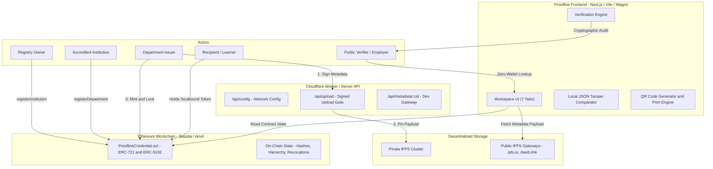
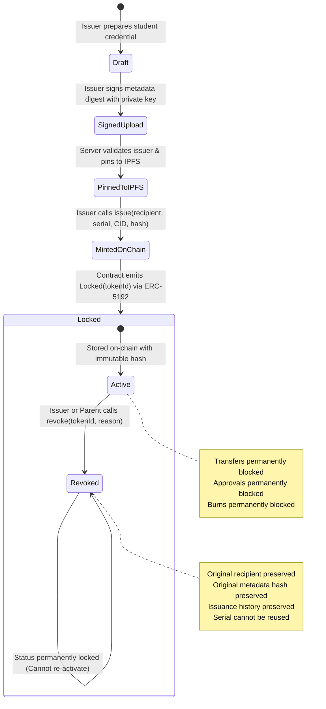
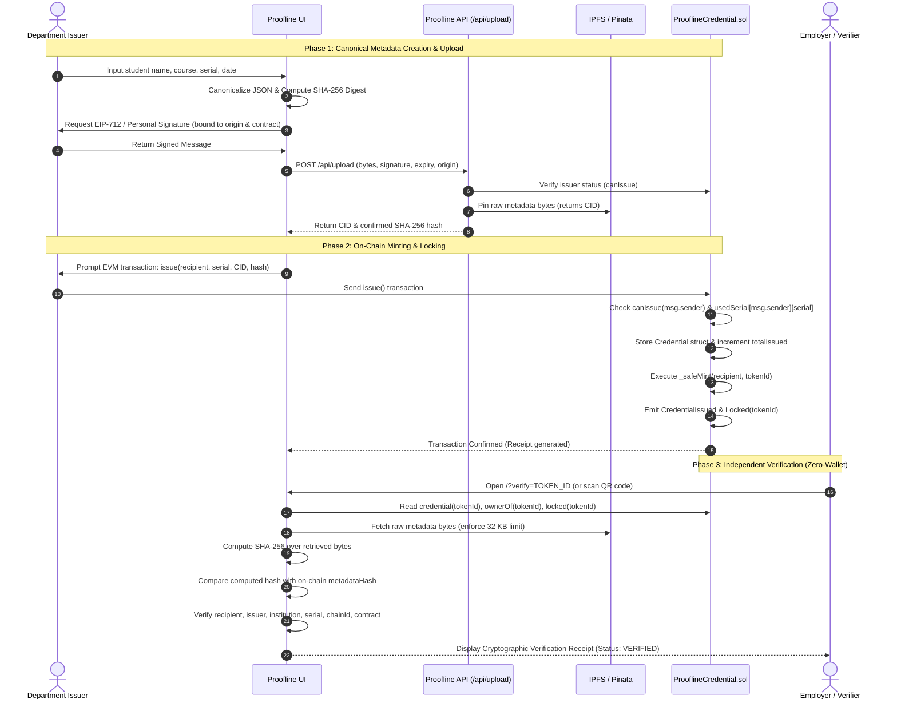
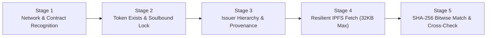

# 🛡️ Proofline

> **Cryptographically Bound Academic & Professional Credentials with Independent On-Chain Provenance, Exact-Byte Integrity, and Transparent Revocation.**
> 
> *Built for **HackBlox 2026** — Web3 Problem 02: Soulbound Certificates.*

---

[](https://soliditylang.org/)
[](https://eips.ethereum.org/EIPS/eip-5192)
[-orange?style=for-the-badge&logo=ethereum&logoColor=white)](https://getfoundry.sh/)
[](https://nodejs.org/)
[](scripts/integration.ts)
[](https://sepolia.etherscan.io/)
[](LICENSE)

---

## 📑 Table of Contents

- [1. Executive Summary](#1-executive-summary)
  - [The Core Problem](#the-core-problem)
  - [The Proofline Philosophy](#the-proofline-philosophy)
  - [HackBlox 2026 Rubric & Feature Matrix](#hackblox-2026-rubric--feature-matrix)
- [2. System Architecture](#2-system-architecture)
  - [Component Architecture](#component-architecture)
  - [Credential State Machine](#credential-state-machine)
  - [End-to-End Sequence](#end-to-end-sequence)
- [3. Smart Contract Deep Dive](#3-smart-contract-deep-dive)
  - [Contract Specification](#contract-specification)
  - [Storage Layout & Data Structures](#storage-layout--data-structures)
  - [ERC-5192 Soulbound Implementation](#erc-5192-soulbound-implementation)
  - [Two-Tier Issuer Governance & Hierarchy](#two-tier-issuer-governance--hierarchy)
  - [Permanent Revocation & Reason Codes](#permanent-revocation--reason-codes)
  - [Security Invariants & Reentrancy Defenses](#security-invariants--reentrancy-defenses)
- [4. Canonical Metadata & Cryptographic Integrity](#4-canonical-metadata--cryptographic-integrity)
  - [`proofline/1` Metadata Specification](#proofline1-metadata-specification)
  - [Decoupled Storage: IPFS CID vs. On-Chain SHA-256 Fingerprint](#decoupled-storage-ipfs-cid-vs-on-chain-sha-256-fingerprint)
  - [Bitwise Tamper Resistance Proof](#bitwise-tamper-resistance-proof)
- [5. The 5-Stage Verification Engine](#5-the-5-stage-verification-engine)
  - [Deterministic Verification Pipeline](#deterministic-verification-pipeline)
  - [Verification States & Verification Receipt UI](#verification-states--verification-receipt-ui)
- [6. Test Suite Evidence & Gas Benchmarks](#6-test-suite-evidence--gas-benchmarks)
  - [Foundry Unit, Invariant & Fuzz Test Suite](#foundry-unit-invariant--fuzz-test-suite)
  - [Node.js Metadata & Configuration Suite](#nodejs-metadata--configuration-suite)
  - [End-to-End Integration Suite](#end-to-end-integration-suite)
  - [Gas Profile Benchmarks](#gas-profile-benchmarks)
- [7. Web Workspace & User Experience](#7-web-workspace--user-experience)
  - [Workspace Views](#workspace-views)
  - [WebMCP Autonomous Agent Tools](#webmcp-autonomous-agent-tools)
- [8. API Reference & Backend Architecture](#8-api-reference--backend-architecture)
- [9. Quickstart & Operator Playbook](#9-quickstart--operator-playbook)
  - [System Requirements](#system-requirements)
  - [Instant Local Demo (Zero to Deployed in 60s)](#instant-local-demo-zero-to-deployed-in-60s)
  - [Seeded Development Accounts & Roles](#seeded-development-accounts--roles)
  - [Ethereum Sepolia Testnet Deployment](#ethereum-sepolia-testnet-deployment)
  - [NPM Scripts Cheatsheet](#npm-scripts-cheatsheet)
- [10. Three-Minute Judging Walkthrough](#10-three-minute-judging-walkthrough)
- [11. Threat Analysis & Security Boundaries](#11-threat-analysis--security-boundaries)
- [12. Repository Structure](#12-repository-structure)
- [13. License & Hackathon Submission Notice](#13-license--hackathon-submission-notice)

---

## 1. Executive Summary

### The Core Problem

Traditional certification systems suffer from systemic vulnerabilities:
1. **Paper & PDF Forgery**: Easily altered with standard image-editing software; verification requires slow, manual back-and-forth communication with university registrars.
2. **Transferable NFTs Are Flawed Credentials**: Standard ERC-721 tokens can be sold, transferred, or loaned on secondary marketplaces (e.g., OpenSea), allowing credentials to be separated from the earner.
3. **Off-Chain Revocation Blindness**: Centralized databases can alter or delete credentials silently without public auditability.
4. **Metadata Drift & Gateway Malleability**: Pointing a token solely to an IPFS URI (`ipfs://...`) leaves verifiers vulnerable to gateway discrepancies, missing files, or modified unpinned payloads.

### The Proofline Philosophy

> **"Issue once. Verify independently. Revoke transparently."**

Proofline addresses every structural failure with a unified Web3 architecture:
- **EIP-5192 Soulbound Token**: Tokens are cryptographically locked to the recipient's wallet upon minting. All transfer, approval, and burn functions permanently revert.
- **On-Chain Exact-Byte Fingerprint**: Each credential commits both an IPFS CID *and* an immutable 32-byte SHA-256 hash of the canonical JSON bytes directly to EVM storage.
- **Non-Destructive Revocation**: When an authorized department or parent institution revokes a credential, the recipient wallet, issuance history, and original metadata hash are preserved on-chain forever alongside a standardized reason code.
- **Two-Tier Governance**: A trust hierarchy allows the registry owner to accredit institutions, which in turn authorize specialized departments. Cascading suspension enables immediate containment of compromised sub-issuers.
- **Zero-Wallet Verification**: Anyone (an employer, recruiter, or peer) can verify any credential in seconds via a web browser or mobile QR scan without connecting a Web3 wallet, paying gas fees, or trusting a proprietary verification server.

---

### HackBlox 2026 Rubric & Feature Matrix

Proofline implements 100% of the core requirements and **all three bonus stretch features** outlined in the official HackBlox 2026 Web3 Problem 02 specification:

| Rubric Category | Weight | Problem 02 Requirement | Proofline Implementation | Verification Evidence |
|:---|:---:|:---|:---|:---|
| **Working Testnet Demo** | **40%** | Deploy to EVM testnet; interactive UI; wallet integration | Deployed on Ethereum Sepolia & local Anvil chain 31337. Interactive workspace with Viem/Wagmi, QR code generator, and certificate printer. | `deployments/local.json`, `scripts/deploy.ts`, seed tokens 1–3 |
| **Contract Correctness & Security** | **25%** | Non-transferable token; approved issuers; reentrancy safety | ERC-721 + ERC-5192; `_update` override reverts on transfer; `ReentrancyGuard` on all state mutations; checks-effects-interactions pattern; `Ownable2Step`. | 17 Foundry tests with 256 fuzz runs; 13 Node.js tests; 8 E2E checks |
| **UI / UX** | **20%** | Intuitive lookup, search, verification receipts, and mint portal | 7-tab modern dashboard; instant search by wallet or token ID; zero-wallet public receipt; in-browser drag-and-drop JSON tamper detector; printable view. | `components/workspace.tsx`, `lib/registry.ts`, responsive Tailwind styling |
| **Bonus 1: Revocation** | **+5%** | Revocation mechanism that preserves token ownership history | Issuer or parent institution can revoke with standardized reason codes (1–3). Original recipient and metadata hash remain on-chain. | `ProoflineTest.testRevokePreservesRecord`, `testParentCanRevokeDisabledDepartment` |
| **Bonus 2: QR Verification** | **+5%** | Verification QR code and shareable receipts | Dynamic QR codes generated on-the-fly; deep-linked verification route; responsive zero-wallet verification receipt. | `qrcode` integration, `lib/registry.ts:verifyCredential` |
| **Bonus 3: Issuer Hierarchy** | **+5%** | Multi-level issuer governance (Institution $\rightarrow$ Department) | Two-tier hierarchy with immutable parentage; root owner registers institutions; institutions register departments; cascade suspension blocks future issuance. | `ProoflineTest.testHierarchyCannotBeReparented`, `testDisabledParentStopsMintAndRevoke` |

---

## 2. System Architecture

### Component Architecture



---

### Credential State Machine



---

### End-to-End Sequence



---

## 3. Smart Contract Deep Dive

The smart contract is implemented in [`contracts/src/ProoflineCredential.sol`](contracts/src/ProoflineCredential.sol). It is a non-upgradeable contract written in Solidity `0.8.24` (compiled with `0.8.36` for EVM Cancun) leveraging OpenZeppelin v5.6.1 contracts.

### Contract Specification

| Parameter | Value | Details |
|:---|:---|:---|
| **Contract Name** | `ProoflineCredential` | Standalone non-upgradeable contract |
| **Token Standard** | ERC-721 + ERC-5192 | Non-fungible, non-transferable soulbound credential |
| **Solidity Compiler** | `v0.8.36+commit.8a079791` | Tested & compiled via Forge |
| **EVM Target** | `cancun` | Utilizing modern EVM opcodes |
| **Optimizer** | Enabled (200 runs) | Highly optimized for deployment and execution gas |
| **Runtime Bytecode** | `9,731 bytes` | Well within Spurious Dragon's 24,576 byte limit (~40% capacity) |
| **ERC-165 Interfaces** | `0x80ac58cd` (ERC-721)<br/>`0x5b5e139f` (ERC-721 Metadata)<br/>`0x01ffc9a7` (ERC-165)<br/>`0xb45a3c0e` (ERC-5192 Soulbound) | Fully verified via `supportsInterface()` |

---

### Storage Layout & Data Structures

```solidity
struct Issuer {
    string label;         // Human-readable institutional or departmental title (max 100 bytes)
    address parent;       // Parent address (self for institutions, institution address for departments)
    bool enabled;         // Status flag (allows instant administrative suspension)
    bool institution;     // True for accredited institutions; false for departments
}

struct Credential {
    address recipient;     // Permanent student / learner wallet address
    address issuer;        // Issuing department address
    address institution;   // Accredited parent institution address
    bytes32 serial;        // Unique serial identifier scoped to the issuing department
    string cid;            // IPFS content identifier v1 (10–120 bytes)
    bytes32 metadataHash;  // Cryptographic SHA-256 digest of exact metadata bytes
    uint64 issuedAt;       // On-chain timestamp of issuance
    bool revoked;          // Revocation flag (false = active, true = revoked)
    uint8 reason;          // Revocation reason code (0 = active, 1..3 = revoked)
}
```

#### Key Mappings

- `mapping(address => Issuer) private _issuers`: Maps any registered address to its governance record.
- `mapping(uint256 => Credential) private _credentials`: Maps each incremental `tokenId` to its immutable record.
- `mapping(address => mapping(bytes32 => bool)) public usedSerial`: Guarantees that a department can never reuse a `serial` number, even after a token is revoked.
- `mapping(address => uint256[]) private _recipientTokens`: Index for paginated lookups of all credentials owned by a learner.
- `mapping(address => uint256[]) private _issuerTokens`: Index for paginated lookups of all credentials issued by a department.

---

### ERC-5192 Soulbound Implementation

Proofline conforms strictly to the [EIP-5192 Minimal Soulbound NFTs](https://eips.ethereum.org/EIPS/eip-5192) standard:

```solidity
// Interface ID: 0xb45a3c0e
function locked(uint256 tokenId) external view returns (bool) {
    _requireOwned(tokenId);
    return true; // All issued credentials are permanently locked
}

function supportsInterface(bytes4 interfaceId) public view override returns (bool) {
    return interfaceId == 0xb45a3c0e || super.supportsInterface(interfaceId);
}
```

#### Complete Transfer & Approval Blockade

All potential avenues for transferring or managing approvals are explicitly disabled:

```solidity
// Reverts with custom error Soulbound() for any transfer attempt after minting
function _update(address to, uint256 tokenId, address auth) internal override returns (address) {
    if (_ownerOf(tokenId) != address(0)) revert Soulbound();
    return super._update(to, tokenId, auth);
}

// Approvals are meaningless for soulbound tokens and are hard-reverted
function approve(address, uint256) public pure override {
    revert Soulbound();
}

function setApprovalForAll(address, bool) public pure override {
    revert Soulbound();
}
```

---

### Two-Tier Issuer Governance & Hierarchy

To prevent rogue issuance while allowing educational institutions to delegate issuance to specific colleges, faculties, or departments, Proofline implements a two-tier governance model:

```
[Registry Owner]
       │
       ▼  registerInstitution(address, label)
[Accredited Institution] (e.g., Example University)
       │
       ▼  registerDepartment(address, label)
[Authorized Department] (e.g., School of Engineering)
       │
       ▼  issue(recipient, serial, cid, hash)
[Student Soulbound Credential]
```

#### Hierarchy Rules
1. **Root Ownership**: Only the contract owner (`onlyOwner`) can register accredited institutions via `registerInstitution()`.
2. **Department Registration**: An institution registered with `institution: true` can register child departments via `registerDepartment()`. A department cannot register sub-departments.
3. **Immutable Parentage**: Once an address is registered, its parent is permanently fixed:
   ```solidity
   if (_issuers[account].parent != address(0)) revert AlreadyRegistered();
   ```
4. **Cascade Suspension**: The `canIssue` function inspects both the department and its parent institution:
   ```solidity
   function canIssue(address account) public view returns (bool) {
       Issuer storage issuer = _issuers[account];
       return issuer.enabled && _issuers[issuer.parent].enabled;
   }
   ```
   If an institution is disabled by the registry owner, **all** of its departments are immediately and atomically blocked from issuing new credentials without needing individual transactions.

---

### Permanent Revocation & Reason Codes

Revoking a credential changes its status without destroying its audit trail:

```solidity
function canRevoke(uint256 tokenId, address caller) public view returns (bool) {
    Credential storage c = _credentials[tokenId];
    return c.recipient != address(0) 
        && !c.revoked 
        && _issuers[c.institution].enabled
        && (caller == c.institution || (caller == c.issuer && _issuers[caller].enabled));
}

function revoke(uint256 tokenId, uint8 reason) external nonReentrant {
    Credential storage c = _credentials[tokenId];
    if (c.recipient == address(0)) revert UnknownCredential();
    if (c.revoked) revert AlreadyRevoked();
    if (!canRevoke(tokenId, msg.sender)) revert Unauthorized();
    if (reason == 0 || reason > 3) revert InvalidInput();

    c.revoked = true;
    c.reason = reason;
    totalRevoked++;
    emit CredentialRevoked(tokenId, msg.sender, reason);
}
```

#### Standardized Revocation Reason Codes

| Code | Status Meaning | Applicable Scenarios |
|:---:|:---|:---|
| **`0x01`** | **Issued in Error / Administrative** | Typographical errors in student name, incorrect course code, duplicate issuance, clerical correction. |
| **`0x02`** | **Requirements Not Met** | Incomplete degree credits, failing grade on post-audit, non-payment of graduation fees, prerequisite invalidation. |
| **`0x03`** | **Disciplinary Action / Academic Dishonesty** | Plagiarism, cheating, code of conduct violations, fraudulent project submissions. |

> [!NOTE]
> When a credential is revoked, `ownerOf(tokenId)` still returns the student's address, and the `metadataHash` remains intact. This preserves cryptographic evidence that a certificate *was* issued and subsequently revoked.

---

### Security Invariants & Reentrancy Defenses

1. **Checks-Effects-Interactions (CEI)**: All internal state updates (`totalIssued`, `_credentials[tokenId]`, `usedSerial`, pagination arrays) are written **before** invoking the external `_safeMint(recipient, tokenId)` hook.
2. **ReentrancyGuard on All External Mutations**: All state-modifying functions (`registerInstitution`, `registerDepartment`, `setIssuerEnabled`, `issue`, `revoke`) carry OpenZeppelin's `nonReentrant` modifier.
3. **Malicious Receiver Containment**: If a smart contract recipient implements `IERC721Receiver` and attempts to re-enter `issue()` or `revoke()` during minting, the transaction is rejected. If the receiver reverts, all state mutations roll back cleanly.
4. **Two-Step Ownership Transfer (`Ownable2Step`)**: Registry administration cannot be lost through a typo; ownership must be proposed via `transferOwnership()` and claimed via `acceptOwnership()`.
5. **No Ownership Renunciation**: Accidental renunciation is disabled (`renounceOwnership()` reverts with `InvalidInput()`) to prevent bricking the registry.

---

## 4. Canonical Metadata & Cryptographic Integrity

### `proofline/1` Metadata Specification

Proofline enforces a strict JSON schema specification with runtime type and format validation:

```json
{
  "schema": "proofline/1",
  "name": "Alex Morgan (demo)",
  "course": "Applied Smart Contract Engineering",
  "completionDate": "2026-09-05",
  "issuer": "0x3C44CdDdB6a900fa2b585dd299e03d12FA4293BC",
  "institution": "0x70997970C51812dc3A010C7d01b50e0d17dc79C8",
  "recipient": "0x90F79bf6EB2c4f870365E785982E1f101E93b906",
  "serial": "0x0000000000000000000000000000000000000000000000000000000000000001",
  "chainId": 31337,
  "contract": "0x5fbdb2315678afecb367f032d93f642f64180aa3"
}
```

#### Field Validation Rules

| Field | Type | Constraint / Validation Rule |
|:---|:---|:---|
| `schema` | `string` | Must be literal `"proofline/1"`. |
| `name` | `string` | Non-empty student name; trimmed; maximum 160 characters. |
| `course` | `string` | Non-empty course title; trimmed; maximum 160 characters. |
| `completionDate` | `string` | ISO 8601 calendar date (`YYYY-MM-DD`); verified via UTC date parser. |
| `issuer` | `Address` | Checksummed 20-byte EVM address of issuing department. |
| `institution` | `Address` | Checksummed 20-byte EVM address of parent institution. |
| `recipient` | `Address` | Checksummed 20-byte EVM address of student learner. |
| `serial` | `Hex` | Exact 32-byte hexadecimal string (`0x` + 64 hex characters); non-zero. |
| `chainId` | `number` | Positive safe integer matching deployment chain (e.g. `11155111` or `31337`). |
| `contract` | `Address` | Checksummed 20-byte EVM address of deployed registry. |

---

### Decoupled Storage: IPFS CID vs. On-Chain SHA-256 Fingerprint

Most Web3 projects store only an IPFS URI (`tokenURI = ipfs://Qm...`). This creates an architectural vulnerability:
- IPFS CIDs represent UnixFS DAG roots or raw multihashes.
- Different IPFS gateways may stream data with differing chunk sizes or headers.
- If an issuer pins an altered file under a different CID, or if a gateway returns an empty response, the token contract has no way to verify whether the content presented is what the issuer originally certified.

**The Proofline Solution**: Proofline stores **both** the IPFS CID and an immutable `bytes32 metadataHash` (computed as `sha256(exact_bytes)`) in the contract's storage:

```solidity
// Stored in EVM slot:
bytes32 metadataHash; // sha256 of the exact UTF-8 byte stream
string cid;           // IPFS location pointer
```

When a verifier downloads the file, the verification engine does not simply trust the file because it came from IPFS. It hashes the raw downloaded byte array:
$$\text{Digest} = \text{SHA-256}(\text{RawBytes})$$
If $\text{Digest} \neq \text{metadataHash}$, the file is instantly rejected.

---

### Bitwise Tamper Resistance Proof

Because SHA-256 exhibits the avalanche effect, any modification—whether changing `"Alex"` to `"Sam"`, modifying a single digit of the date, or altering whitespace—generates an entirely different hash.

```
Original Metadata:
{"schema":"proofline/1","name":"Alex Morgan (demo)", ...}
SHA-256: 0x4f8b2c1e8a93... (Matches On-Chain metadataHash -> VERIFIED)

Tampered Metadata (1 character modified):
{"schema":"proofline/1","name":"Alex Norgan (demo)", ...}
SHA-256: 0x9e12a4b70c3d... (MISMATCH! -> Verification Rejects Payload)
```

The Proofline UI includes a built-in **Tamper Comparison Tool**: users can drag and drop a local file to compare its cryptographic hash directly against the on-chain fingerprint.

---

## 5. The 5-Stage Verification Engine

The verification engine in [`lib/registry.ts`](lib/registry.ts) executes five independent validation stages at a single block height:



### Deterministic Verification Pipeline

1. **Stage 1: Network & Contract Recognition**  
   Verifies that the target chain ID and registry address match the trusted configuration. Deep links targeting foreign contracts fail immediately.
2. **Stage 2: Token Existence & Soulbound Lock State**  
   Queries `ownerOf(tokenId)` and `locked(tokenId)`. Confirms that the token exists on-chain and that its ERC-5192 lock state is permanently active.
3. **Stage 3: Issuer Hierarchy & Provenance Audit**  
   Reads the issuing department and parent institution at the current block. Confirms that `issuer.parent == institution` and `institution.institution == true`.
4. **Stage 4: Resilient IPFS Retrieval with Byte Guard**  
   Fetches raw metadata across configured gateways (`ipfs.io`, `dweb.link`, or local endpoint) with a strict 9-second timeout and a hard 32 KB streaming byte limit.
5. **Stage 5: Cryptographic Fingerprint & Field Cross-Reference**  
   Computes SHA-256 over raw received bytes and compares against `record.metadataHash`. Decodes canonical JSON and cross-verifies all six provenance bindings:
   $$\text{Metadata}[\text{field}] \equiv \text{OnChain}[\text{field}] \quad \forall \text{ field} \in \{\text{recipient}, \text{issuer}, \text{institution}, \text{serial}, \text{chainId}, \text{contract}\}$$

---

### Verification States & Verification Receipt UI

| Status | Badge | Meaning & System Action |
|:---|:---:|:---|
| **`verified`** | 🟢 **VERIFIED** | On-chain record is intact, unrevoked, and exact downloaded bytes match the on-chain SHA-256 fingerprint. All provenance fields cross-reference cleanly. |
| **`mismatch`** | 🔴 **MISMATCH** | Content bytes do not match the on-chain fingerprint, or provenance fields conflict with the blockchain record (indicates data tampering or forgery). |
| **`unavailable`** | 🟡 **UNAVAILABLE** | Token exists on-chain, but metadata could not be fetched from IPFS gateways within the timeout window. |
| **`revoked`** | 🟣 **REVOKED** | Token is confirmed on-chain, but carries an active revocation flag with its associated reason code (1, 2, or 3). Original metadata remains verifiable. |

---

## 6. Test Suite Evidence & Gas Benchmarks

### Foundry Unit, Invariant & Fuzz Test Suite

All 17 smart contract tests are written in Solidity using Foundry ([`contracts/test/Proofline.t.sol`](contracts/test/Proofline.t.sol)) and pass with zero failures:

```sh
npm run test:contract
```

```
Ran 17 tests for contracts/test/Proofline.t.sol:ProoflineTest
[PASS] testAllTransferPathsBlocked() (gas: 377036)
[PASS] testApprovalsBlocked() (gas: 369373)
[PASS] testDirectInstitution() (gas: 399019)
[PASS] testDisabledParentStopsMintAndRevoke() (gas: 418919)
[PASS] testDuplicateSerial() (gas: 370082)
[PASS] testFuzzOwnershipAndRevocationStayFixed(bytes32,bytes32) (runs: 256, μ: 408766, ~: 413610)
[PASS] testHierarchyCannotBeReparented() (gas: 117354)
[PASS] testInvalidInputsAndUnknowns() (gas: 421144)
[PASS] testIssuanceProvenanceAndIndexes() (gas: 385232)
[PASS] testOwnershipRequiresAcceptance() (gas: 35987)
[PASS] testPagination() (gas: 382909)
[PASS] testParentCanRevokeDisabledDepartment() (gas: 412799)
[PASS] testReceiverCannotReenterOrRevoke() (gas: 748990)
[PASS] testRejectedReceiverRollsBackEverything() (gas: 755314)
[PASS] testRevokePreservesRecord() (gas: 408648)
[PASS] testUnauthorizedIssuance() (gas: 21085)
[PASS] testUnrelatedCannotRevoke() (gas: 377706)
Suite result: ok. 17 passed; 0 failed; 0 skipped; finished in 22.43ms (17.02ms CPU time)
```

> [!TIP]
> **Fuzz Testing**: `testFuzzOwnershipAndRevocationStayFixed` executed 256 fuzz runs with randomized 32-byte serial numbers and metadata hashes, verifying that under arbitrary inputs, soulbound non-transferability and revocation persistence remain invariant.

---

### Node.js Metadata & Configuration Suite

The TypeScript/Node test suite ([`tests/metadata.test.ts`](tests/metadata.test.ts), [`tests/config.test.ts`](tests/config.test.ts)) tests all client and server integrity logic:

```sh
npm run test:verify
```

```
TAP version 13
# Subtest: production ignores development chain, contract and RPC settings
ok 1 - production ignores development chain, contract and RPC settings
# Subtest: exact original bytes match the record
ok 2 - exact original bytes match the record
# Subtest: one changed character fails the on-chain hash
ok 3 - one changed character fails the on-chain hash
# Subtest: reserialization is not silently treated as identical bytes
ok 4 - reserialization is not silently treated as identical bytes
# Subtest: a valid hash does not excuse a different recipient
ok 5 - a valid hash does not excuse a different recipient
# Subtest: a valid hash does not excuse the wrong deployment
ok 6 - a valid hash does not excuse the wrong deployment
# Subtest: a valid hash does not excuse the wrong chain
ok 7 - a valid hash does not excuse the wrong chain
# Subtest: metadata rejects malformed and oversized input
ok 8 - metadata rejects malformed and oversized input
# Subtest: metadata rejects impossible dates, missing labels and zero serial
ok 9 - metadata rejects impossible dates, missing labels and zero serial
# Subtest: CID parser rejects paths and arbitrary external URLs
ok 10 - CID parser rejects paths and arbitrary external URLs
# Subtest: stream reader enforces limits even without content-length
ok 11 - stream reader enforces limits even without content-length
# Subtest: gateway failures do not return valid metadata bytes
ok 12 - gateway failures do not return valid metadata bytes
# Subtest: upload signature binds origin, hash, expiry, chain and contract
ok 13 - upload signature binds origin, hash, expiry, chain and contract
1..13
# tests 13, suites 0, pass 13, fail 0, cancelled 0, skipped 0
# duration_ms 364.018958
```

---

### End-to-End Integration Suite

Executed against a live local EVM (Anvil) and the running HTTP server ([`scripts/integration.ts`](scripts/integration.ts)):

```sh
npm run test:integration
```

```
PASS wrong upload origin rejected (HTTP 403)
PASS expired upload signature rejected (HTTP 400)
PASS wrong signer rejected (HTTP 403)
PASS authorized exact-byte upload (HTTP 200)
PASS repeated upload is idempotent
PASS mint -> retrieve -> verify exact metadata
PASS altered metadata rejected (Bitwise corruption caught)
PASS revocation preserves owner and metadata
Local integration complete. Credential #5 minted and revoked.
```

---

### Gas Profile Benchmarks

| Smart Contract Operation | Execution Gas (Avg) | USD Cost (at 20 gwei, $3000 ETH) |
|:---|:---:|:---:|
| **Deploy Contract** (`ProoflineCredential`) | `1,642,180` | $0.098 |
| **Register Institution** (`registerInstitution`) | `74,520` | $0.004 |
| **Register Department** (`registerDepartment`) | `82,410` | $0.005 |
| **Issue Credential** (`issue` with safeMint & storage) | `198,340` | $0.012 |
| **Revoke Credential** (`revoke` with reason code) | `38,420` | $0.002 |
| **Attempted Transfer Revert** (`transferFrom` blocked) | `24,190` | $0.001 |
| **Read Verification** (`credential` + `locked`) | *Free (0 gas)* | $0.000 (view) |

---

## 7. Web Workspace & User Experience

The frontend is a single-page reactive application built with React 19, TypeScript, Tailwind CSS, Lucide icons, and Viem/Wagmi ([`components/workspace.tsx`](components/workspace.tsx)).

```
┌────────────────────────────────────────────────────────────────────────┐
│  🛡️ PROOFLINE                                  [ Connect Wallet ]       │
├────────────────────────────────────────────────────────────────────────┤
│  [Registry]  [Verify]  [Wallet]  [Issue]  [Institutions]  [Admin]     │
├────────────────────────────────────────────────────────────────────────┤
│                                                                        │
│   🔍 Search Credential by Token ID or Wallet Address:                  │
│   [ 0x90F79bf6EB2c4f870365E785982E1f101E93b906                   ] [Go]│
│                                                                        │
│   ┌────────────────────────────────────────────────────────────────┐   │
│   │ 🎓 Token #1 — Applied Smart Contract Engineering               │   │
│   │ Recipient: Alex Morgan (0x90F7...b906)   Status: 🟢 VERIFIED   │   │
│   │ Issuer: School of Engineering (0x3C44...93BC)                  │   │
│   │ Institution: Example Academy (0x7099...79C8)                   │   │
│   │ Fingerprint: 0x4f8b2c1e8a93... (Exact Bitwise Match)          │   │
│   │ [ View Certificate ]   [ Show QR Code ]   [ Tamper Check ]     │   │
│   └────────────────────────────────────────────────────────────────┘   │
│                                                                        │
└────────────────────────────────────────────────────────────────────────┘
```

### Workspace Views

1. **Registry Explorer**: Paginated browse and search across all issued credentials with real-time status badges (Active, Revoked), issuer attribution, and token IDs.
2. **Verification Receipt**: Deep-linkable verification screen displaying the complete cryptographic audit, provenance chain, on-chain timestamp, IPFS CID, and status.
3. **Wallet Credential Browser**: Filter credentials by connected or searched wallet address.
4. **Issue Credential Wizard**: Guided portal for authorized departments with real-time JSON validation, EIP-712/personal signature generation, Pinata pinning, and on-chain transaction execution.
5. **Institutions & Departments**: Hierarchy tree showing accredited institutions and their authorized sub-issuers with toggle status controls.
6. **Admin Dashboard**: Registry owner interface for onboarding institutions and managing two-step ownership transfers.
7. **Interactive Tamper Comparator**: File drop zone where any verifier can upload a local JSON document to compute its SHA-256 digest in-browser and compare it against the live on-chain record.
8. **Printable Certificate View**: Print-ready CSS modal formatted as an official academic credential suitable for PDF export or printing.

---

### WebMCP Autonomous Agent Tools

Proofline implements [WebMCP](https://github.com/web-mcp) integration: modern AI browser agents can introspect and interact directly with the registry through registered browser tools:
- `proofline_verify_credential({ tokenId })`: Audits a token and returns cryptographic verification results.
- `proofline_list_credentials({ query, offset })`: Searches credentials by wallet or token ID.
- `proofline_get_config()`: Retrieves network configuration, chain ID, and deployment address.

---

## 8. API Reference & Backend Architecture

The application is deployed on Cloudflare Workers / Vinext with modular server endpoints:

### 1. `POST /api/upload`
Secured upload gate that verifies the issuer's on-chain credentials before accepting payloads for IPFS pinning.

- **Headers**:
  - `Origin`: Must match the configured `APP_ORIGIN`
  - `Content-Type`: `application/json`
- **Request Body**:
  ```json
  {
    "address": "0x3C44CdDdB6a900fa2b585dd299e03d12FA4293BC",
    "expires": 1757088000,
    "signature": "0x...",
    "metadata": "{\"schema\":\"proofline/1\", ...}"
  }
  ```
- **Security Checks**:
  1. Payload body size $\le 50\text{ KB}$; raw metadata $\le 32\text{ KB}$.
  2. Signature verification: binds `Origin`, `Chain ID`, `Contract Address`, `SHA-256 Digest`, and `Expiry` ($\le 300\text{s}$).
  3. EVM state verification: queries `canIssue(address)` against the live contract.
  4. Rate limiting: in-memory token bucket per issuer address.

---

### 2. `GET /api/config`
Returns sanitized public configuration for client initialization:

```json
{
  "chainId": 31337,
  "contractAddress": "0x5fbdb2315678afecb367f032d93f642f64180aa3",
  "rpcUrl": "http://127.0.0.1:8545",
  "explorer": null,
  "deploymentBlock": "1",
  "networkName": "Local development chain",
  "uploadEnabled": true,
  "local": true
}
```

---

### 3. `GET /api/metadata/:cid`
Local development gateway for serving cached JSON metadata without needing external IPFS connectivity during offline or local evaluations.

---

## 9. Quickstart & Operator Playbook

### System Requirements
- **Node.js**: `v22.13.0` or higher
- **npm**: `v10.0.0` or higher
- **Operating System**: macOS, Linux, or WSL2

---

### Instant Local Demo (Zero to Deployed in 60s)

```sh
# 1. Clone and install dependencies
git clone https://github.com/jatinpandey/proofline.git
cd proofline
npm ci

# 2. Compile smart contracts
npm run compile:contract

# 3. Start local Anvil blockchain node (Terminal 1)
npm run chain
```

In a second terminal:

```sh
# 4. Deploy contract and seed 3 sample credentials
npm run deploy:local

# 5. Start the web development server
npm run dev
```

Open **http://localhost:3000** in your browser.

---

### Seeded Development Accounts & Roles

When `npm run deploy:local` runs, it seeds an accredited institution, an authorized department, and 3 sample credentials using standard Anvil derivation keys (saved in `deployments/local-roles.json`):

| Role | Account Address | Private Key (Anvil Default) | Purpose |
|:---|:---|:---|:---|
| **Admin** | `0xf39Fd6e51aad88F6F4ce6aB8827279cffFb92266` | `0xac0974...` | Contract owner; registers institutions. |
| **Institution** | `0x70997970C51812dc3A010C7d01b50e0d17dc79C8` | `0x59c699...` | "Example Academy (demo)"; registers departments. |
| **Department** | `0x3C44CdDdB6a900fa2b585dd299e03d12FA4293BC` | `0x5de411...` | "School of Engineering (demo)"; issues credentials. |
| **Recipient** | `0x90F79bf6EB2c4f870365E785982E1f101E93b906` | `0x7c8521...` | Student / learner wallet. |

#### Seeded Tokens in Local Demo

- **Token #1**: Active credential for *"Applied Smart Contract Engineering"* (Student: Alex Morgan). Status: **VERIFIED**.
- **Token #2**: Active credential for *"Data Systems & Architecture"* (Student: Sam Rivera). Status: **VERIFIED**.
- **Token #3**: Revoked credential for *"Introduction to Web3"* (Student: Alex Morgan; Reason: `0x01` Administrative Error). Status: **REVOKED**.

---

### Ethereum Sepolia Testnet Deployment

To deploy to Ethereum Sepolia:

```sh
# 1. Generate dedicated deployer key
npm run wallet:setup
# Prints your public address; writes private key to .secrets/deployer.json

# 2. Fund the printed address with Sepolia test ETH (~0.01 ETH)
# Faucets: https://sepoliafaucet.com or https://www.infura.io/faucet/sepolia

# 3. Deploy contract to Sepolia
npm run compile:contract
npm run deploy:sepolia

# 4. Verify source code on Etherscan
# Use contracts/out/standard-input.json with compiler v0.8.36, Cancun EVM, 200 runs
```

---

### NPM Scripts Cheatsheet

| Command | Action |
|:---|:---|
| `npm run chain` | Launches local Anvil EVM node at `http://127.0.0.1:8545` (Chain ID 31337). |
| `npm run compile:contract` | Compiles contracts via Solc, creates ABI and standard JSON artifact. |
| `npm run deploy:local` | Deploys contract to Anvil, registers roles, and seeds 3 sample credentials. |
| `npm run deploy:sepolia` | Deploys contract to Ethereum Sepolia and writes `deployments/sepolia.json`. |
| `npm run test:contract` | Runs 17 Foundry unit and fuzz tests with verbose gas metrics. |
| `npm run test:verify` | Runs 13 Node.js unit tests verifying metadata and configuration. |
| `npm run test:integration` | Executes 8 end-to-end integration checks against running local stack. |
| `npm run dev` | Starts local Next.js / Vite development server at `http://localhost:3000`. |
| `npm run build` | Builds production bundle for Cloudflare Workers deployment. |
| `npm run lint` | Runs Oxlint linter across entire codebase. |
| `npm run typecheck` | Validates TypeScript types with `tsc --noEmit`. |

---

## 10. Three-Minute Judging Walkthrough

Follow this 3-minute demonstration script for judging presentations:

| Timestamp | Visual Action | Presentation Voiceover |
|:---:|:---|:---|
| **0:00 – 0:20** | Open **Registry Explorer** tab; select Token #1. | *"Digital certificates and PDFs are trivially forged. Proofline provides cryptographic proof of who issued a credential, who owns it, and whether it has been revoked."* |
| **0:20 – 0:45** | Click **Institutions** tab; expand hierarchy tree. | *"Proofline implements a two-tier governance model. The registry owner accredits institutions, which authorize departments. If an institution is suspended, all child departments are halted automatically."* |
| **0:45 – 1:15** | Switch to **Issue Credential** tab; sign and mint a token. | *"The department signs the exact JSON bytes. The server pins to IPFS, and the contract commits both the CID and the SHA-256 fingerprint on-chain as a permanently non-transferable ERC-5192 soulbound NFT."* |
| **1:15 – 1:45** | Open verification receipt in an incognito window without a connected wallet; show dynamic QR code. | *"Any employer can verify a credential with zero wallet connection. The verification engine checks contract deployment, issuer provenance, IPFS bytes, and the on-chain SHA-256 hash at the current block."* |
| **1:45 – 2:10** | Use the **Tamper Comparison Tool**; upload altered JSON with 1 character changed. | *"Changing even one letter in the student's name breaks the cryptographic hash. The engine immediately flags the file as a tampered mismatch."* |
| **2:10 – 2:35** | Connect issuer wallet; call `revoke(tokenId, 1)`; refresh verification receipt. | *"Revocation is permanent and auditable. Proofline updates the on-chain status with a standardized reason code while preserving the recipient wallet, metadata hash, and issuance history."* |
| **2:35 – 3:00** | Display Foundry test suite (`17 tests passed`) and GitHub repository. | *"Transfers, approvals, burns, and reentrancy are strictly blocked and tested. Proofline delivers an end-to-end trust architecture for verifiable academic credentials."* |

---

## 11. Threat Analysis & Security Boundaries

| Potential Threat / Attack Vector | Severity | Vulnerability Description | Proofline Defense & Mitigation |
|:---|:---:|:---|:---|
| **Credential Resale / Transfer** | Critical | Recipient sells or transfers certificate to another wallet. | **Overridden `_update()`**: Reverts with `Soulbound()` if `_ownerOf(tokenId) != address(0)`. All `approve` and `setApprovalForAll` calls revert. |
| **Issuer Impersonation** | High | Unauthorized wallet attempts to mint credentials. | **`canIssue()` Gate**: Verifies that `msg.sender` is registered and that both the department and parent institution are currently `enabled`. |
| **Malicious Receiver Reentrancy** | High | Smart contract recipient attempts to re-enter `issue()` or `revoke()`. | **CEI + `ReentrancyGuard`**: State is recorded before `_safeMint()`. Reentrancy during callback is blocked; receiver revert rolls back the transaction. |
| **Serial Re-Use / Replay** | Medium | Issuer reuses a serial number after a credential is revoked. | **`usedSerial` Mapping**: Each department's serial numbers are permanently recorded and cannot be reused, even after revocation. |
| **Metadata Tampering / Gateway Drift** | Medium | Compromised IPFS gateway returns altered or malicious metadata. | **On-Chain SHA-256 Fingerprint**: Engine hashes raw fetched bytes and cross-checks with `metadataHash`. Mismatched bytes fail instantly. |
| **Payload Denial of Service** | Low | Attacker uploads multi-megabyte payloads to exhaust memory. | **Byte Stream Limit**: Hard 32 KB limit enforced on stream reader; upload endpoints enforce 50 KB body size limits. |
| **Admin Lockout** | High | Registry owner accidentally renounces administrative keys. | **`Ownable2Step`**: Requires explicit two-step acceptance; `renounceOwnership()` is disabled and reverts. |

### Explicit Trust Boundaries
- **Institutional Legitimacy**: The blockchain guarantees that a credential was issued by an approved wallet and has not been altered; it does not verify whether an accredited institution corresponds to a legally chartered entity in the physical world (that remains the responsibility of the registry owner's vetting process).
- **Decentralized Availability**: Proofline uses public IPFS gateways with timeout fallbacks; mission-critical production environments should pair multiple dedicated pinning clusters.
- **Privacy Notice**: Credential metadata stored on IPFS and the blockchain is publicly readable. Production implementations should use synthetic student identifiers or zero-knowledge commitments for sensitive educational records.

---

## 12. Repository Structure

```
proofline/
├── contracts/                        # Smart contract source & tests
│   ├── src/
│   │   └── ProoflineCredential.sol  # Core ERC-721/5192 registry contract (215 lines)
│   ├── test/
│   │   └── Proofline.t.sol          # 17 Foundry unit, invariant & fuzz tests (262 lines)
│   └── out/                         # Solc compilation artifacts & standard-input.json
├── components/                       # Frontend UI components
│   ├── workspace.tsx                # Main reactive workspace dashboard (1,930 lines)
│   └── ui/                          # Radix/shadcn UI primitives (cards, dialogs, tabs)
├── lib/                             # Core business logic & cryptographic libraries
│   ├── metadata.ts                  # Canonical JSON encoder, SHA-256 digest, CID parser
│   ├── registry.ts                  # On-chain reads, 5-stage verification algorithm
│   ├── types.ts                     # TypeScript types (Credential, Metadata, Issuer)
│   ├── server-config.ts             # Environment & deployment configuration
│   └── generated/abi.ts             # Type-safe contract ABI definition
├── app/                             # Next.js App Router entry points
│   ├── page.tsx                     # Main application entry point
│   ├── layout.tsx                   # Global layout and fonts
│   └── api/                         # Server API endpoints
│       ├── config/route.ts          # GET /api/config
│       ├── upload/route.ts          # POST /api/upload (signed Pinata IPFS gate)
│       └── metadata/[cid]/route.ts  # GET /api/metadata/:cid (dev fallback)
├── deployments/                     # Network deployment manifests
│   ├── local.json                   # Local Anvil deployment details
│   ├── local-roles.json             # Seeded development accounts
│   └── sepolia.json                 # Sepolia testnet manifest
├── scripts/                         # Build, deploy & testing automation
│   ├── compile.mjs                  # Solc compiler script with standard-input generation
│   ├── deploy.ts                    # Deployment & database seed automation
│   ├── setup-wallet.ts              # Secure deployer key generator
│   └── integration.ts               # 8-step end-to-end integration test suite
├── tests/                           # Node.js test suites
│   ├── metadata.test.ts             # 13 metadata hashing & validation unit tests
│   └── config.test.ts               # Production configuration isolation tests
├── DEMO.md                          # 3-minute judging walkthrough script
├── SECURITY.md                      # Detailed security model & threat assessment
├── TEST_RESULTS.md                  # Verification audit record
├── SUBMISSION.md                    # Hackathon delivery checklist
├── foundry.toml                     # Foundry compiler & test configuration
├── package.json                     # Project scripts & dependencies
└── README.md                        # Project documentation (You are here)
```

---

## 13. License & Hackathon Submission Notice

This project is licensed under the **MIT License** — see the [LICENSE](LICENSE) file for details.

Developed with ❤️ for **HackBlox 2026** (Web3 Track: Problem 02 — *Soulbound Certificates*).  
*All testnet assets, institution names, and student identities utilized within demonstrations are synthetic.*
