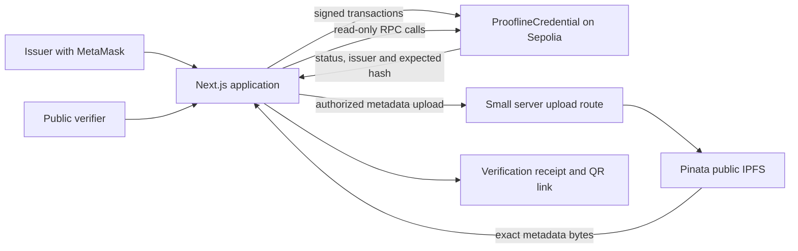

# HackBlox final: recommendation and implementation plan

Researched 5 September 2026, approximately 11:00 IST. Planning document; no application has been implemented or deployed.

## Decision

Choose **Web3 problem statement 02: On-Chain Verifiable Credentials (Soulbound Certificates)**. Build **Proofline**, a working title for a credential issuing and verification product: **“Issue once. Verify independently. Revoke transparently.”**

This is my strongest recommendation for a solo entrant working with coding assistance in the remaining sprint. It is a judgment about execution risk and rubric fit, not a prediction of the judges' scores or a guarantee of winning. Your registered track and permission to switch remain unconfirmed. If you are restricted to AI, use the AI contingency below; a credentials dApp would not satisfy that challenge.

The [official Web3 PDF](https://www.hackblox.xyz/web3-hackathon-problem-statements.pdf), page 4, allocates 40% to a working testnet demo, 25% to contract correctness/security, 20% to UX, and 15% to creativity/bonuses. This makes complete, demonstrable execution the priority. A straightforward credential core gives us time to earn the difficult execution points and implement all three relevant bonuses.

The [results page](https://www.hackblox.xyz/results) lists Jatin Pandey in Team Rize with one member in Phase 1. If that is your entry, it supports the solo scope. The public lists do not establish track choice, opponent project quality, or reliable winning odds. I accept your statement that you are a finalist; this is not a fresh eligibility determination.

## Why this statement wins the comparison

These are engineering assessments under a roughly 23-hour remaining window. There are no invented numerical win probabilities or estimated judge scores.

| Choice | Strongest advantage | Main obstacle in this sprint | Recommendation |
|---|---|---|---|
| Soulbound credentials | Complete, understandable demo; read-only public verification; three closely related bonuses | A generic certificate minter is unremarkable; issuer trust and revocation must be explicit | **First: best balance of delivery confidence and scoring headroom** |
| Freelance escrow | Excellent money-at-risk narrative and visible milestone payouts | Three actor roles, payout/reentrancy paths, disputes, accounting and potential stuck funds; reputation can be gamed | Second; can become first with a strong Solidity teammate or existing compliant expertise |
| Milestone crowdfunding | Rich governance demonstration | Voting deadlines/quorum, contribution accounting, partial refunds, double claims and stalled campaigns create many failure paths | Third for a solo sprint |
| 3LC scene classification | Clear quantitative evaluation and mandatory data-centric workflow | Different rubric; needs provided kit/data, useful training compute, labeling effort and reproducible experiments | Choose if AI-bound or already strong in this workflow; not directly scored against Web3 |

Requirements for the three dApps are in the [Web3 specification](https://www.hackblox.xyz/problem-statements?track=web3). The [AI challenge](https://www.hackblox.xyz/problem-statements?track=ai) is a fixed ResNet-18 competition, not an invitation to build an arbitrary AI app.

Credentials and blockchain verification already exist. [Blockcerts](https://www.blockcerts.org/guide/faq.html) checks integrity and revocation and discusses issuer/recipient identity. [ERC-5192](https://eips.ethereum.org/EIPS/eip-5192) already standardizes minimal soulbinding. We should claim excellent implementation and a clear verification experience, not invention of blockchain certificates.

## Product and judging story

The first customer hypothesis is a small course provider, university department or hackathon organizer issuing completion certificates. The first verifier is someone checking that record. This is a proposed customer segment, not validated customer demand.

The differentiator is an **inspectable verification receipt**. Every result explains what was checked: recognized deployment, token existence, issuer provenance, metadata integrity, wallet binding, and current revocation. A copied QR still leads to the original recipient's record; changed metadata fails verification; a revoked credential stays visible with its invalid status.

For a prospective pilot, show fictional “Example Academy → Software Department → Demo Learner” records. The system could demonstrate event certificates, but do not imply HackBlox has adopted or endorsed it.

| Scoring area | Evidence we will put in front of the judge |
|---|---|
| Working demo, 40% | Public URL; new mint and revocation on Sepolia; explorer links; verification from an unconnected browser |
| Correctness/security, 25% | Restricted issuance, scoped hierarchy, immutable records, blocked transfer paths, negative tests and reproducible test command |
| UX, 20% | Plain verification result; address/token lookup; wallet needed only for actions; wrong-network, pending, rejection and failure handling |
| Creativity/bonuses, 15% | Revocation, QR sharing, institution/department delegation; verification receipt ties them together |

The website labels each bonus “+5%,” but the published rubric totals 100% with a 15% creativity category. Plan around that category; do not assume a score of 115% or automatic points for a checkbox.

## Scope and completion order

**P0: required complete product.** Admin authorizes issuers. Authorized issuer uploads metadata to IPFS and mints a permanently non-transferable NFT to a recipient. Public user searches by wallet or token ID and sees certificate and issuer information. MetaMask actions, tested contract, verified Sepolia deployment and a hosted frontend work end to end.

**P1: submission target.** Add irreversible revocation without burning, generated QR links, and a fixed two-tier institution/department issuer hierarchy. Add a transparent verification receipt, original metadata download, and an altered-JSON comparison that computes a real hash mismatch. These are the planned competitive finish, contingent on the P0 checkpoint passing.

**P2: only if everything above is verified.** Printable certificate view, simple gas measurements, short usability feedback session, additional visual polish. A wallet ownership challenge can be a later extension; it is not needed for the required public verifier.

**Excluded from the sprint:** token payments, marketplace, custom chain, DAO, mainnet launch, zero-knowledge proofs, account abstraction, bulk imports, institution identity APIs, AI fraud scoring, mobile app, custom indexer and full W3C credential interoperability. A public SBT record is not automatically a [W3C Verifiable Credential](https://www.w3.org/TR/vc-data-model-2.0/).

## Architecture

Use one application contract and one web application. Blockchain state is authoritative; a database is unnecessary for credential validity.



| Component | Choice | Reason |
|---|---|---|
| Contract | Solidity, pinned compatible compiler; OpenZeppelin Contracts 5.x pinned to a release | Established ERC-721 and ownership building blocks |
| Contract tooling | Foundry: Forge tests/deploy, Anvil locally | Fast contract tests and deterministic local chain |
| Web | Next.js, TypeScript, React, Tailwind | Public pages and small protected upload route in one application |
| Chain client | Wagmi + viem + TanStack Query | Wallet connection, typed reads/writes, transaction tracking |
| Storage | Public IPFS via Pinata, immutable CID and separate raw-byte SHA-256 | Required metadata storage with independently checked bytes |
| Hosting | Vercel or existing compatible host | Public demo and server environment secrets |
| Testing | Forge; Vitest for verifier; Playwright against Anvil | Tests at actual trust boundaries |
| Network | Sepolia, chain ID 11155111 | Named in the challenge; verify RPC health early |

Use [Wagmi's current integration guidance](https://wagmi.sh/react/getting-started), [OpenZeppelin ERC-721 documentation](https://docs.openzeppelin.com/contracts/5.x/api/token/erc721), and [Pinata's upload documentation](https://docs.pinata.cloud/files/uploading-files). Lock compatible versions at initialization rather than mixing copied tutorials. Node 22.23.1, pnpm and Git are available in this workspace; Forge and Anvil were not found on PATH during research. Allow setup time. If Foundry setup consumes over 30 minutes, use a pinned compatible Hardhat toolchain and preserve the same behavior/tests.

Although the problem sheet also names Mumbai, Polygon's [official announcement](https://forum.polygon.technology/t/introducing-the-amoy-testnet-for-polygon-pos/13388) documents its deprecation. Use Sepolia. Do not switch to an unlisted chain without organizer clearance.

## Smart-contract design

`ProoflineCredential` inherits ERC-721 and `Ownable2Step`, and implements ERC-5192 detection. No upgrade proxy, payments or arbitrary external execution. Ownership controls the root issuer registry; it cannot silently rewrite certificates.

**Data model**

- `Institution`: address, immutable display label/profile reference for the demo, enabled flag. Registered once by root admin.
- `Department`: address, immutable parent institution, immutable label, enabled flag. Registered once by its enabled institution. An address cannot be both tiers or be reparented.
- `Credential`: token ID, recipient, original issuing address, parent institution snapshot, issuer-local random serial, metadata CID, `bytes32 metadataSha256`, issuance block timestamp, revocation flag and revocation reason code.
- Indexes: recipient → token IDs; issuer → token IDs; institution → department addresses. Paginate reads, max 50 records per call. Serial uniqueness is scoped to issuer; retrying a completed mint cannot duplicate its serial.

An enabled institution can mint directly, or delegate minting to departments. For direct institution issuance, `issuer == parentInstitution == institutionAddress`; a department credential records `issuer == departmentAddress` and `parentInstitution == itsInstitutionAddress`. Use that convention in metadata, authorization and verification. A department can mint only while both it and its parent are enabled. No arbitrary-depth permission tree.

**Write operations**

| Operation | Allowed caller | Guard and result |
|---|---|---|
| `registerInstitution(address, label)` | Root owner | Nonzero new address, bounded label; cannot overwrite |
| `setInstitutionEnabled(address, bool)` | Root owner | Known institution; affects future issuance and delegation |
| `registerDepartment(address, label)` | Enabled institution | New address; parent permanently becomes caller |
| `setDepartmentEnabled(address, bool)` | Its parent institution | Cannot control another institution's department |
| `issue(recipient, serial, cid, sha256)` | Enabled institution or department with enabled parent | Valid nonzero recipient, unused serial, bounded nonempty CID, nonzero hash; records provenance and mints |
| `revoke(tokenId, reasonCode)` | Enabled parent institution, or original enabled department while its parent is enabled | Existing unrevoked token; irreversibly marks revoked and emits event |

The exact revocation rule is `parentEnabled && (caller == recordedParent || (caller == recordedIssuer && departmentEnabled))`; the second branch applies only to department-issued records. For direct issuance, only the enabled institution revokes. A disabled parent blocks all revocations in its namespace until re-enabled; there is no root override. Test this explicitly. The root owner has no direct certificate-revocation method in this scope. It can suspend an institution's future issuance; existing tokens retain their history. If a department is disabled or compromised, its enabled parent can revoke affected certificates. A compromised institution/root key needs operational incident response beyond the prototype; this limitation must be documented.

**Soulbinding:** In OpenZeppelin 5.x, enforce the no-transfer/no-burn invariant in `_update`: reject updates to an already-owned token. Allow only initial mint. Keep no public burn/unlock method. Explicitly reject approval-granting functions so the UI does not suggest transferable permissions. `locked(tokenId)` returns true for existing tokens and rejects nonexistent IDs; `supportsInterface` includes `0xb45a3c0e`. Emit `Locked` on mint. Test `transferFrom` and both `safeTransferFrom` overloads. The required interface is specified by [ERC-5192](https://eips.ethereum.org/EIPS/eip-5192); OpenZeppelin 5.x replaced the older transfer hooks with [`_update`](https://docs.openzeppelin.com/contracts/5.x/changelog).

**Mint safety:** Reserve serial/token ID and populate state before the `_safeMint` receiver callback; transaction reverts atomically on receiver failure. Use the same reentrancy guard on issuance, revocation and custom registry mutations, so an authorized contract receiver cannot revoke the token or change issuer status during its mint callback. Emit custom `CredentialIssued` and `Locked` events after `_safeMint` completes; its standard `Transfer` event happens inside `_safeMint`. Test malicious receivers attempting each protected mutation. Do not merely add `ReentrancyGuard` and treat that as a complete security review.

**Lifecycle:** Unissued → issued → revoked. Revocation preserves ownership and metadata. Disabling an issuer stops future minting but does not retroactively revoke its old credentials. Show issuer suspension separately from credential revocation. The issue-time authority is recorded by contract state/events. This avoids making old graduates invalid when staff change.

**Read operations:** Paginated recipient and issuer lists; credential detail; issuer/parent details and enabled state; token URI; locked state. Read lookup requires no wallet. Store sufficient data on-chain so a verifier can operate without a proprietary event-indexing service.

**Events:** InstitutionRegistered/StatusChanged, DepartmentRegistered/StatusChanged, CredentialIssued, CredentialRevoked, plus ERC-721 Transfer and ERC-5192 Locked. Index recipient and issuer for retrieval/audit. Cache a receipt's block number and issuance/revocation transaction links separately; status always comes from a fresh chain read.

## Metadata and verification algorithm

Metadata contains schema version, name, course, completion date, issuer address, parent address, recipient address, serial, chain ID and deployment address. Use fictional learner data and labels explicitly marked as demo institutions. The certificate's authoritative issue time is the chain timestamp; a course completion date is an issuer claim.

1. Validate the form. Construct a UTF-8 JSON file once, with stable field order, and compute SHA-256 over its **exact bytes** in the browser.
2. Upload those same bytes through the protected server route to public IPFS. Obtain the CID. Do not pin a parsed-and-reserialized variant.
3. Mint using recipient, serial, CID and SHA-256. Confirm the successful receipt; obtain the allocated token ID from its event. The metadata uses serial, not a guessed next token ID.
4. Generate a share URL carrying chain ID, contract address and token ID. The verifier only accepts the known deployment; it does not trust an arbitrary address supplied in a QR.
5. Read credential, owner, issuer provenance and revocation from the configured chain, pinning every read to the same recorded block number. Parse and validate the CID with a maintained CID library before constructing a gateway URL. Fetch metadata bytes by CID from an allowed gateway, with size/time limits.
6. Hash the fetched bytes and compare to the on-chain SHA-256 before displaying trusted fields. Validate schema and cross-check recipient, issuer, parent, serial, chain and contract against the record.
7. Display explicit outcomes: Verified record; Revoked; Unknown credential; Metadata mismatch; Unsupported deployment; Unable to verify. Show chain status and metadata integrity as separate fields. A confirmed revoked flag always produces a revoked headline, even if metadata is unavailable or mismatched; show that additional issue separately. An unsupported deployment or absent token ends trusted verification immediately. A timeout is not a forgery result and must never be displayed as verified.

The IPFS CID is not treated as a raw-file SHA-256 string: its codec/import structure can differ. Storing an explicit digest avoids that implementation error. Retain original metadata for download and the tamper demonstration. IPFS availability requires [pinning/persistence](https://docs.ipfs.tech/concepts/persistence/); changing gateways should not change valid bytes.

The optional altered-file demonstration accepts a local JSON file, computes its digest in the browser and compares it with the selected credential. Label this “Compare credential metadata”; it does not inspect arbitrary diploma images or detect every forgery. Editing one character in a real exported file must produce a real mismatch.

**Upload security:** Server-only `PINATA_JWT`; never put it in public environment variables. The issuer signs an expiring, domain/chain/contract-bound upload authorization containing the metadata hash. Verify signature and current issuer permissions server-side; bind it to the uploaded bytes. Permit JSON only, maximum 32 KB, and rate-limit/deduplicate uploads by issuer and content digest. The server can upload metadata but cannot issue tokens. If the hosted upload service fails, allow an existing CID plus original metadata bytes, verify hash locally, and keep the genuine on-chain flow.

## Screens and interaction design

| Route | What the user can do | Finish criterion |
|---|---|---|
| `/` | Enter wallet address or token ID; open a labeled demo record | First-time visitor can reach a result without installing a wallet |
| `/verify/[chain]/[contract]/[tokenId]` | Inspect credential, issuer path, status, verification receipt, explorer and IPFS links | No green verified state before every required check passes |
| `/wallet/[address]` | Browse paginated credentials; filter valid/revoked while retaining history | Correct empty state; all records accessible through pagination |
| `/issuer` | Connect wallet, mint, inspect own records, revoke | Actions reflect real permissions and successful receipts |
| `/institution` | Approve departments and disable their future issuance | Parent-scoped controls; no cross-institution access |
| `/admin` | Register/enable institutions | Root-owner transaction flow; no browser-only access control |

Visual direction: light paper background, dark ink typography, one restrained accent; readable certificate layout; visible status labels and icons. Use a compact issuer chain diagram. Avoid a page full of NFT trading terminology. Technical evidence lives in an expandable “Verification details” area.

Every write has distinct states: review → waiting for signature → submitted with transaction hash → confirmed or failed. Handle rejection, wrong chain, insufficient test gas, duplicate submission, dropped/replaced transaction and RPC failure. Re-query permissions after wallet/account changes. Verification displays last checked block/time; cached pages cannot silently keep showing valid after a confirmed revocation. Use copy buttons, keyboard access, mobile layout and text labels alongside color.

## Tests and measurable acceptance

These are targets for implementation, not claims of tests already passed.

| Area | Required proof |
|---|---|
| Access control | Unauthorized mint/register/revoke fail; unrelated institution cannot manage another department or credential |
| Hierarchy | Disabled parent blocks all child minting; disabled child cannot mint; reparenting and conflicting roles fail |
| Non-transferability | All three transfer entry points, approval grants and transfer to self fail after mint; no burn/unlock |
| Minting | Correct owner/issuer/parent/URI/hash/events; duplicate serial fails; zero recipient and oversized/empty data rejected |
| Revocation | Issuer and parent paths work; repeated revocation fails; recipient/metadata unchanged; nonexistent token fails |
| Callback safety | Malicious receiver cannot reenter issuance, revoke or mutate issuer registry during mint; rejected receiver leaves no reserved serial; event order is deterministic |
| Invariants/fuzzing | Ownership never changes; revocation never reverses; immutable metadata/provenance never change; count/indexes agree |
| Verification | Valid bytes pass; one-byte change fails; malformed/oversized metadata rejected; gateway timeout gives unknown state |
| Deployment isolation | A token on a different contract/chain is not treated as this issuer's record |
| UI integration | Mint → recipient lookup → no-wallet verify → revoke → refreshed revoked result, using a real local contract |
| Submission smoke test | Repeat key flow on public Sepolia and deployed frontend; successful transactions have explorer evidence |

Record actual test output, deployed addresses, compiler/settings, transaction hashes and gas used. Aim for zero failing tests and full coverage of permission/state-changing branches; do not promise an unmeasured coverage percentage. Contract tests are meaningful for this change because mistakes affect public trust and irreversible chain state.

## Delivery schedule for the remaining final

The official sprint ends **6 September, 10:00 IST**. This schedule starts at 11:00 IST on 5 September; if implementation begins later, use the cut rules below. These are estimates for one developer with coding assistance, not guaranteed durations.

| IST window | Work | Exit checkpoint |
|---|---|---|
| Sep 5, 11:00–12:00 | Confirm track/portal, preserve OSS evidence, initialize repo/toolchain, fund test wallets, validate RPC and IPFS | Testnet dependencies usable; local chain and frontend run |
| 12:00–15:00 | Contract including hierarchy/revocation storage and permissions, soulbinding, immutable metadata and focused tests | Required state transitions and negative tests pass; contract scope frozen |
| 15:00–16:00 | First deployment and explorer verification; export ABI/address; pin sample metadata | Verified contract exists on Sepolia before UI expansion |
| 16:00–19:00 | Issuer mint form, token/wallet lookup, public verifier, real wallet integration | **P0 works on deployed demo URL** |
| 19:00–21:00 | Revocation UI, QR sharing, two-tier issuer administration UI | P1 paths tested against the existing contract |
| 21:00–23:00 | Verification receipt, file comparison, wrong-network and pending/error UX | Main demo story works without developer tools |
| 23:00–01:00 | Full tests, fuzz cases, hosted deployment smoke tests, fix failures | No unresolved critical correctness issue |
| Sep 6, 01:00–06:00 | Break/rest and contingency reserve | Working deployment stays available |
| 06:00–08:00 | README, architecture, limitations, provenance/license notes; rehearse and record | 2–3 minute video and submission links ready |
| 08:00–09:00 | Final clean-checkout verification, tag/release, early submission | Receipt/screenshots of submitted entry saved |
| 09:00–10:00 | Submission buffer; fix only if necessary and before freeze | No late commits or unfinished upload |

**Deployment rule:** Implement and test the intended hierarchy/revocation contract surface before the first Sepolia deployment; P1 primarily adds its UI. Any later contract fix requires time for redeployment, explorer verification, issuer re-registration, reseeding and replacing all old ABI/address/QR references before recording. Reserve at least one hour from the contingency block for that path. Do not present an old verified address as the fixed deployment.

**Cut rules:** If P0 is not live by 19:00, stop cosmetic work and prioritize complete required paths. If fewer than 12 hours remain at kickoff, reduce the initial contract scope to direct issuers and revocation, then add QR; defer department hierarchy. With fewer than 6 hours, deliver only P0 plus QR if trivial, tests, video and verified deployment. Cut stretch goals before testing, explorer verification or submission time. Never present deferred features as working.

Human responsibilities: confirm registered track and finalist messages, access the actual submission portal, handle wallet/account credentials and signing as needed, obtain test gas/API credentials, assess the demo story and submit under the participant's identity. I can implement the application, tests, deployment scripts and documentation; public deployment depends on those accounts and working services. No paid API or GPU is required for this Web3 design; provider free-plan availability must be checked at setup.

## Repository and submission structure

```text
apps/web/                         Next.js pages, wallet provider, upload API
packages/contracts/src/          ProoflineCredential.sol
packages/contracts/test/         Unit, callback and invariant tests
packages/contracts/script/       Deploy and demo setup scripts
packages/shared/                 ABI, deployment constants, metadata schema
deployments/sepolia.json          Address, chain, block, compiler and explorer
docs/ARCHITECTURE.md              State, trust boundaries and decisions
docs/DEMO.md                      Script and live transaction links
docs/SECURITY.md                  Invariants, tests and limitations
README.md                        Setup, live demo, statement mapping
.env.example                     Variable names only
LICENSE                          Chosen license and dependency notices
```

The public Web3 repository must include contract, frontend and tests. Submission bundle: live URL, verified contract link, repository link, 2–3 minute video or presentation, tagged commit and any required OSS PR evidence. The website names the RDM app but exposes no clear submission URL; obtain that from the official finalist channel. Source-control a manifest so the frontend, ABI, explorer and video all refer to the same final deployment. Record every official requirement and where it is demonstrated in the README.

## Three-minute demo script

| Time | Demonstration |
|---|---|
| 0:00–0:20 | “A certificate can be copied. Here is a record whose issuer, contents and current status anyone can inspect.” Show Example Academy/department hierarchy. |
| 0:20–1:00 | Department wallet issues a new certificate to the demo recipient. Show signature, transaction hash and confirmation. |
| 1:00–1:35 | Open its QR/link in an unconnected browser. Show recipient, issuer path, integrity result and explorer evidence. |
| 1:35–1:55 | Load a modified copy of its metadata: real digest mismatch. Show original file succeeds. |
| 1:55–2:30 | Issuer revokes. After confirmed receipt, refresh public verification: revoked, ownership/history preserved. |
| 2:30–3:00 | Show test evidence, non-transferability and three implemented bonuses. State the trust boundary: the institution vouches for achievement; chain verifies its record. |

Have prefunded accounts, seeded genuine on-chain valid/revoked records and a screen recording ready. Use a new credential for rehearsal and another for recording since revocation cannot be undone. For slow inclusion, move to an existing verified record while the new transaction is pending and label that accurately. A recording is a fallback, not evidence of a successful live transaction that did not occur.

## Honest answers to likely judge questions

- **Why blockchain?** It gives verifiers a shared record of issuer authorization, issuance and revocation without depending on the issuer's editable database. Institutional trust still exists.
- **Can a fake university enroll?** Admin onboarding is an explicit trust boundary. The demo has fictional approved institutions; real identity vetting is future operational work.
- **Can someone copy a QR or buy a wallet?** A copied link still shows the original recipient. Soulbinding prevents token transfer; it cannot prevent private-key sharing or prove a person's real-world identity. A holder-signature challenge is future work.
- **Are student details private?** Public IPFS and public chain data are not confidential. Demo uses synthetic details. A real deployment needs a consent and privacy design before publishing personal records.
- **What happens when an issuer is disabled?** Future minting stops; prior credentials retain their recorded validity unless individually revoked. UI displays the current issuer suspension separately.
- **Does this replace W3C credentials?** No. The challenge asks for a soulbound NFT. Standards-based credential interoperability is a later integration, not a claimed feature.
- **Is it production secure?** It is a tested testnet prototype. Independent review, key custody, issuer onboarding, recovery and privacy work remain before production.

## AI contingency if track switching is unavailable

Obtain the official Kaggle URL, starter kit, data and 3LC access from the finalist channel immediately. The downloadable rulebook requires fixed ResNet-18, training from scratch, supplied data only, and a final active training table no larger than 3,000 rows including 600 seeds. The [AI PDF](https://www.hackblox.xyz/HACKBLOX_2026_AI_Track_3LC_Scene_Classification.pdf) describes 1,200 validation and 1,800 test images; keep validation held out and test labels untouched.

Build a reproducible experiment pipeline rather than a new app: submit the 600-label baseline early; inspect 3LC confusion and embeddings; curate three batches of up to 800 additional labels, combining uncertain examples with embedding diversity and class balance. Human-review ambiguous glacier/mountain and buildings/street cases; do not indiscriminately bulk-label from model guesses. Compare each revision using held-out validation, record seeds/checkpoint/table lineage and training configuration, and keep the best justified checkpoint. Avoid external images, pretrained embeddings, test-label recovery, or unconfirmed ensembling/pseudo-labeling strategies.

Timebox setup/baseline to 2 hours, three label/train/analyze loops to about 12 hours depending on measured compute, and leave at least 4 hours for final reproducibility, Kaggle selection and evidence packaging. If compute is slow, run fewer higher-quality loops. There is no supported accuracy promise without running the actual data.

Submit a clean 1,800-row CSV with image_id, integer prediction 0–5, numeric confidence 0–1; verify IDs against the template, and explicitly select up to two final submissions. Complete the required evaluation form before the deadline, export the full 3LC project and screenshots, and add the named judge to the private repo following the PDF while resolving the conflicting public-repo instruction. Every member needs a 3LC account. The page weights private accuracy 50%, methodology 25%, reproducibility 15%, and write-up/error analysis 10%; its 50/50 test split is a separate concept. Exact daily submission limits and offline weighting precedence need the actual competition rules.

## First executable step

Confirm Web3 eligibility and the real submission portal, then implement and test the smallest real chain flow: authorize issuer → mint IPFS-backed soulbound certificate → public verification. Deploy that before adding bonuses. Keep the rulebook conflicts and full source inventory in [RULES_AND_RESEARCH.md](/Users/jatinpandey/Antigravity/Hackblox/RULES_AND_RESEARCH.md).
